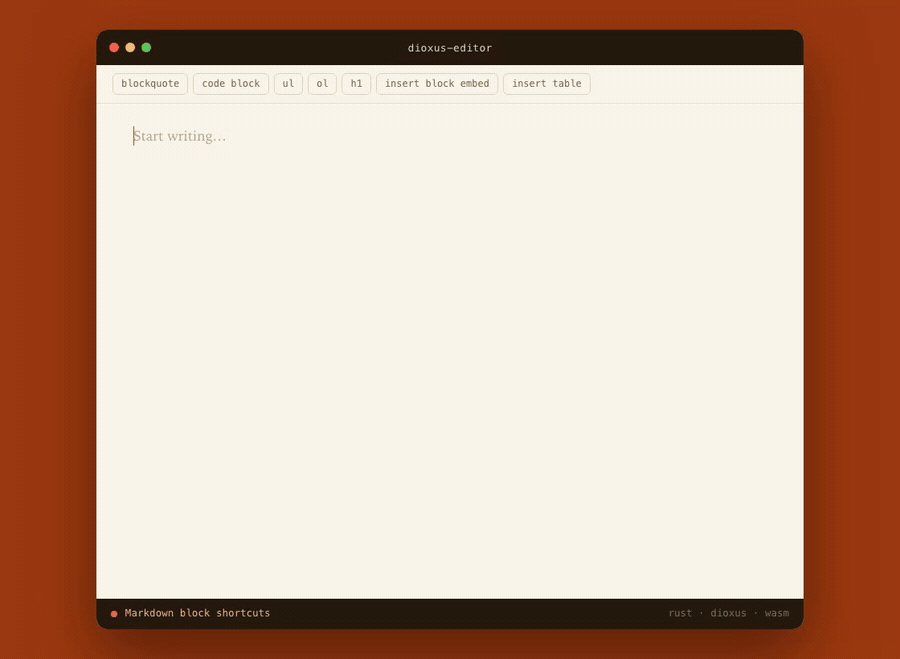
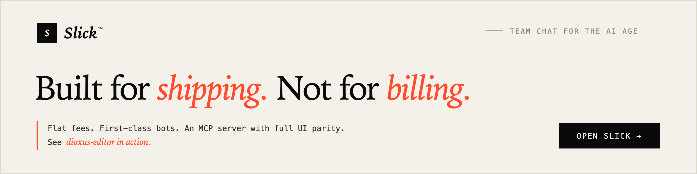

<div align="center">

# dioxus-editor

**A pluggable rich-text editor for [Dioxus](https://dioxuslabs.com)** — transaction-based document model, Markdown input/output, decorators, history, and a contenteditable view. Entirely in Rust.

[](https://github.com/danielkov/dioxus-editor/actions/workflows/ci.yml)
[](https://github.com/danielkov/dioxus-editor/tags)
[](#license)
[](#compatibility-and-version-policy)
[](#compatibility-and-version-policy)
[](https://slick.chat)



</div>

## Features

- **Transaction-based core** — every change is an explicit, inspectable `Transaction`; no hidden DOM state
- **Markdown in and out** — `# `, `**bold**`, `> `, and list shortcuts as you type, plus full Markdown import/export
- **Pluggable** — keymaps, undo/redo history, and Markdown shortcuts are plugins you opt into
- **Decorators** — render arbitrary Dioxus components (links, embeds, @mentions with a custom picker) as schema-backed nodes inside the document
- **Editable tables** — with keyboard navigation between cells
- **Accessible** — ARIA-labelled, keyboard-first editing
- **Bring your own styling** — the crate exposes semantic CSS class names but ships **no** CSS; applications own all editor styling (see the [styling reference](docs/styling.md))

## Quick start

```toml
[dependencies]
dioxus-editor = { git = "https://github.com/danielkov/dioxus-editor", tag = "v1.0.0" }
```

```rust
use dioxus::prelude::*;
use dioxus_editor::{plugins, use_editor, EditorConfig, EditorView, Schema};

#[component]
fn App() -> Element {
    let editor = use_editor(|| {
        EditorConfig::new(Schema::new())
            .with_plugin(Box::new(plugins::DefaultKeymap))
            .with_plugin(Box::new(plugins::History::new()))
            .with_plugin(Box::new(plugins::MarkdownShortcuts::new()))
    });

    rsx! { EditorView { editor, aria_label: "Article body" } }
}
```

By default, Enter splits the current block. Supplying `on_submit` opts into submit-on-Enter; Shift+Enter always splits the block.

## Styling

The editor renders semantic class names (`editor__*` for blocks, `e-t`/`e-b`/ `e-i`/`e-s`/`e-c` for text runs) and ships no CSS of its own. The [styling reference](docs/styling.md) documents every class and data attribute the crate emits, plus the two CSS rules the editor relies on to behave correctly.

## Compatibility and version policy

| dioxus-editor | Dioxus         | Minimum Rust | Status     |
| ------------- | -------------- | ------------ | ---------- |
| 1.x           | >=0.7.10, <0.8 | 1.88         | Maintained |
| 2.x           | >=0.8, <0.9    | 1.88         | Maintained |

Major editor versions track Dioxus compatibility. The maintained 1.x/Dioxus 0.7 line is available from the [`1.x` branch](https://github.com/danielkov/dioxus-editor/tree/1.x).

---

<a href="https://slick.chat">
  
</a>

---

## Contributing

Contributions are welcome. See [CONTRIBUTING.md](CONTRIBUTING.md) for the development setup, test suite, and how the demo gif is regenerated.

## License

Licensed under either [Apache License 2.0](LICENSE-APACHE) or [MIT](LICENSE-MIT), at your option.
